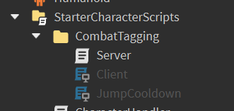

# Entry 2
### Learning more about Lua
##### 12/23/23
Learning more about Lua I wanted to see how it was applied and see how it was done. I decided to do that from getting copies of other games as I wanted to see how they manage to script a specfic thing. The game I decided to get a copy of was A Bizarre Day as it was the first thing that came to mind when I thought about fighting games.

```lua
for _, c in pairs(ReplicatedStorage:GetChildren()) do
	if (c:IsA("RemoteEvent") and c.Name:match("Damage")) then
		c.OnServerEvent:Connect(function(player, hum)
			if (player ~= Player) then return end
			if (typeof(hum) ~= "Instance") or (hum:IsA("Humanoid")) then return end
			local chr = hum.Parent;
			local plr = Players:GetPlayerFromCharacter(chr)
			if (plr == nil) and (string.lower(chr.Name):match("dummy")) then return end
			TagCombat();
		end)
	end
end
```




This code snippet over here is a part of a combat tag system from the server side which if you were attacked or attacking someone then you would have to fight as leaving the game will punish you. This snippet especially intrigued me as it used a for loop but the syntax of it confused me as I've been used to just making one variable for iterating through but this has two and even says `in pairs()`. What I hope to further accomplish during the break is to gain a better understanding of the code in this game and apply that new gained knowledge to my own game and not have to copy but rather understand as well as a better understanding of the other intricacies of roblox games like the connection between client and server through remote events.

For my Engineering Design Process I'll say that I'm still at stage 2 as I'm still researching about Lua and Roblox Studio as it is a new language I am learning as well as a new game engine that has its own quirks just like I had mentioned before like the connections between client and server.

As for skills, I am demonstrating how to learn as I decided to change my learning approach as I wanted to see how others apply their knolwedge and try to replicate but later on gain an understanding. Another skill I am demonstrating is attention to detail as I look through code that other people have made for a specific purpose and see how it all works and links towards each other.


[Previous](entry01.md) | [Next](entry03.md)

[Home](../README.md)