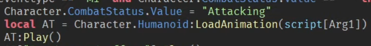

# Entry 4
### 4/5/24
### Animation

From my last blog entry I did mention learning moon animator which is something I will talk about for this blog entry. Starting off moon animator was a little bit intimiding but watching this [tutorial](https://www.youtube.com/watch?v=q8tGNMo_jHg&t=148s) really helped as I got to understand how animation works with keyframes alongside if I wanted to attach a part to the character for the animation.

As you can see each individual limbs have their own key frames for which you can move around. Now that I have an animation my problem is now how do I implement it to where when I click on a key it runs the animation. That was until I watched this [video](https://www.youtube.com/watch?v=tnvlWtuCqUw) for which it gave a part of how it play the animation in one of the script which was what I was looking for. 

## Takeaways
What I learned from between entry three to this entry is I learnt how to at least use the tool for animation alongside with some more lua knowledge for playing animations.

For my engineering design process I would say I am at the part of "researching the problem" as the animation is essential to my minimum viable product and having that learnt gives better closure that the MVP will be done

For skills I applied, they would be how to learn as what I was learning at this point was how to animate in order to make the moves in my game. The other skill would be having a growth mindset as it did take some time to fully process what I was learning with this tool without Roblox Studio.

[Previous](entry03.md) | [Next](entry05.md)

[Home](../README.md)